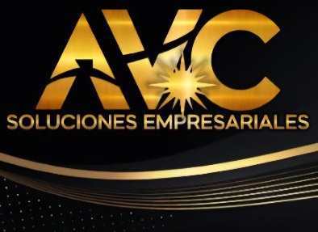
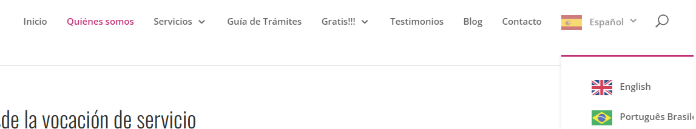
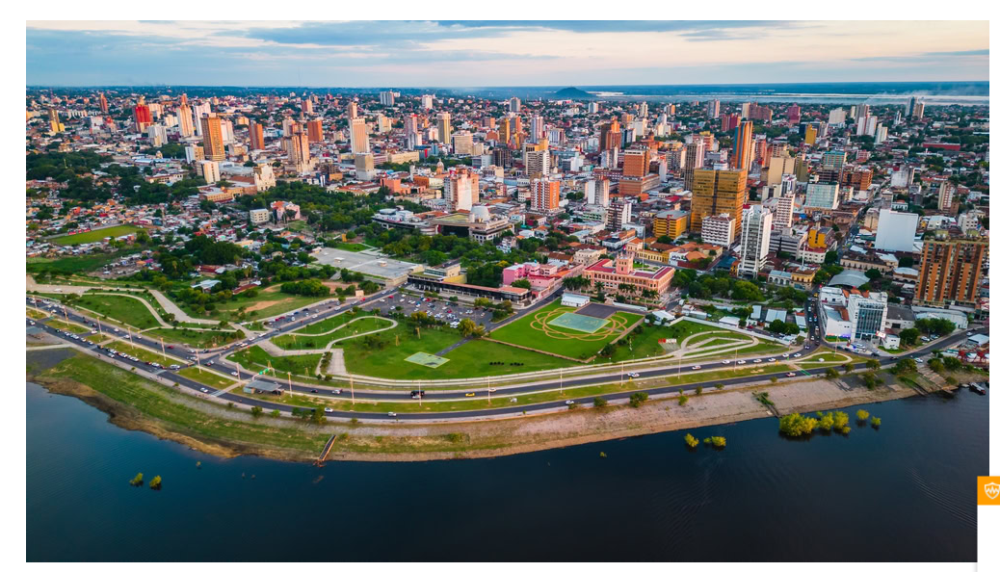

# AVC Soluciones Empresariales — Información Completa

> Documento consolidado a partir de tres fuentes:
> 1. **Sitio web actual** → https://avcsoluciones.com.py/
> 2. **BRIEF – AVC Consultores** (`BRIEF_-_AVC_CONSULTORES.docx`)
> 3. **Requerimientos de Optimización y Actualización Web** (`Requerimientos de Optimización y Actualización Web AVC Soluciones Empresariales.docx`)
>
> _Recopilado el 30/06/2026. Las imágenes descargadas están en la carpeta [`imagenes/`](imagenes/)._

---

## 1. Identidad de la empresa

| Dato | Detalle |
|------|---------|
| **Nombre comercial / marca** | AVC Soluciones Empresariales |
| **Razón social** | AVC Soluciones Empresariales E.A.S. |
| **Rubro / actividad principal** | Consultoría y asesoría empresarial integral |
| **Slogan** | *"Impulsando tu crecimiento con soluciones integrales y asesoría experta"* |
| **Ciudad / País** | San Lorenzo – Departamento Central – Paraguay |
| **Años de trayectoria** | (No especificado en el brief) |

**Descripción breve (oficial del brief):**
> AVC Soluciones Empresariales E.A.S. brinda asesoramiento integral y personalizado en contabilidad, finanzas, auditoría, recursos humanos, asesoría jurídica y marketing, ayudando a empresas y emprendedores a optimizar su gestión, cumplir normativas y crecer de forma sostenible.

**Descripción tal como aparece hoy en la web:**
> Somos una consultora empresarial que acompaña a empresas y emprendedores con soluciones integrales y asesoramiento personalizado, ayudándolos a ordenar su gestión, cumplir normativas y crecer de forma sostenible.

**Logo (alta resolución, extraído del brief):**



---

## 2. Misión, Visión y Valores

**Misión:**
> Brindar soluciones empresariales integrales y asesoría personalizada que permitan a las empresas optimizar sus procesos administrativos, financieros y operativos, fomentando la innovación, el crecimiento sostenible y la competitividad.

**Visión:**
> Consolidarse como una consultora referente en soluciones empresariales integrales en Paraguay, reconocida por su profesionalismo, innovación y acompañamiento estratégico.

**Valores:**
- Integridad y ética profesional
- Compromiso con la excelencia
- Innovación constante
- Atención personalizada
- Desarrollo sostenible de los clientes

---

## 3. Servicios / Productos

Servicios que deben aparecer en la web (según brief; el orden de la web actual varía ligeramente):

| # | Servicio | Descripción | Dirigido a |
|---|----------|-------------|------------|
| 1 | **Asesoría contable y fiscal** | Gestión contable integral y cumplimiento tributario conforme a la normativa paraguaya. | Emprendedores, PYMES y empresas consolidadas. |
| 2 | **Auditorías internas y externas** | Evaluación de procesos, control interno y estados financieros para transparencia y mejora continua. | Empresas medianas y grandes. |
| 3 | **Gestión de recursos humanos** | Administración del talento humano, cumplimiento laboral y desarrollo organizacional. | Empresas en crecimiento. |
| 4 | **Asesoría jurídica empresarial** | Apoyo legal en contratos, cumplimiento normativo y prevención de riesgos legales. | Empresas y emprendedores. |
| 5 | **Consultoría en marketing y publicidad** | Estrategias de marketing digital y posicionamiento de marca orientadas a resultados. | Empresas que buscan visibilidad y crecimiento comercial. |
| 6 | **Capacitaciones empresariales y acompañamiento a emprendedores** | Talleres y formación práctica en gestión empresarial. | Emprendedores y equipos administrativos. |

> 🆕 **Servicio nuevo a incorporar** (ver requerimientos): **Tecnología y Sistemas**.

---

## 4. Diferenciales de la empresa

1. **Oferta integral** que centraliza múltiples áreas clave del negocio en un solo proveedor.
2. **Asesoramiento personalizado** adaptado al tamaño, sector y etapa de cada empresa.
3. **Uso de tecnología adaptada** y enfoque en capacitación continua y acompañamiento real.

---

## 5. Público objetivo

- **Tipo de cliente:** Empresas · Comercios · Profesionales _(no consumidor final)_
- **Zona de alcance:** San Lorenzo, Área Metropolitana y expansión progresiva a nivel nacional.
- **Principal necesidad del cliente:** Optimizar la gestión empresarial, cumplir normativas y mejorar la rentabilidad de forma sostenible.

---

## 6. Datos de contacto

| Canal | Dato |
|-------|------|
| **WhatsApp / Teléfono principal** | +595 991 437 021 |
| **Email de contacto general** | info@avc-soluciones.com |
| **Dirección física** | Prof. Simeón Lombardo esq. Los Emblemas – San Lorenzo, Paraguay |
| **Horario de atención** | Lunes a viernes, 8:00 a 18:00 hs |

**Correos corporativos a crear con el dominio** (ejemplos del brief): `info@`, `ventas@`, `administracion@`, `soporte@`.

### Redes sociales
- **Instagram:** https://www.instagram.com/avc.soluciones_empresariales/ (@avc.soluciones_empresariales)
- **Facebook:** https://web.facebook.com/profile.php?id=61577989658195
- **LinkedIn:** https://www.linkedin.com/company/108613748/
- TikTok / YouTube / Otras: No aplica

---

## 7. Estado actual del sitio web (https://avcsoluciones.com.py/)

- **Plataforma:** WordPress.
- **Desarrollado por:** Consultoría Digital (`Consultoriadigital.io`).
- **Copyright pie de página:** © 2026.

### Menú de navegación actual
`Inicio` · `Nosotros` · `Servicios` · `Contacto`

### Secciones / textos visibles
- **Hero / encabezado:** "Impulsamos tu crecimiento con soluciones integrales y asesoría experta" + botones **SERVICIOS** y **CONTACTO**.
- **Nosotros:** descripción de la consultora (ver sección 1).
- **Servicios:** los 6 servicios listados arriba.
- **Llamado a la acción:** "Conversemos sobre el crecimiento de tu empresa" → botón **CONTACTANOS** (WhatsApp).
- **Contacto:** ubicación San Lorenzo, WhatsApp, email y horario.

### Imágenes principales del sitio (descargadas en [`imagenes/web/`](imagenes/web/))

| Archivo | Descripción | Resolución |
|---------|-------------|------------|
| `imagen-34.png` | Imagen de la sección Servicios: profesional firmando documentos (tono oscuro/elegante). | 1600 × 900 |
| `cropped-logo.png` | Logo AVC usado en el sitio. | 591 × 218 |
| `cropped-logo-1.png` | Variante cuadrada del logo / favicon. | 512 × 512 |
| `cropped-logo-137x51.png` | Logo del encabezado. | 137 × 51 |
| `cropped-logo-300x111.png` | Logo tamaño medio. | 300 × 111 |


---

## 8. Requerimientos de Optimización y Actualización Web

> Documento dirigido a Consultora Digital con las modificaciones, mejoras y nuevos módulos solicitados.

### 8.1. Mejoras de Identidad Visual e Interfaz (UI/UX)
- **Optimización de elementos gráficos:** reemplazar y mejorar el logotipo y otros elementos que hoy se ven **pixelados / baja resolución**, para que se vean nítidos en pantallas de alta densidad.
- **Modernización de iconografía:** actualizar los íconos hacia una línea más limpia, moderna y profesional.
  - **Referencia:** estilo visual de **Baker Tilly Paraguay** → https://www.bakertilly.com.py/

### 8.2. Ajustes en la Página de Inicio
**Diversificación de imágenes sectoriales.** Hoy solo hay imágenes de la sección Servicios (profesionales interactuando). Se necesita contenido visual de los demás sectores clave:
- **Comercio:** imágenes asociadas a dinámicas de compra-venta.
- **Industria:** planta industrial con operarios y maquinaria en funcionamiento.
- **Agricultura y Ganadería:** contenido visual del sector agropecuario.

### 8.3. Nuevo módulo: "Información para Inversionistas Extranjeros"
- **Internacionalización / selector de idiomas:** habilitar e integrar de forma funcional un selector de idiomas en el menú superior con soporte completo para **Español**, **English** y **Português Brasileiro**.

  _Referencia visual del selector (extraída del documento):_

  

- **Sección dedicada a inversores del exterior**, con estos elementos:
  - **Encabezado visual dinámico:** al ingresar, una fotografía de alta calidad de Paraguay / Asunción / principales ciudades económicamente atractivas, con **efecto de movimiento (scroll interactivo / parallax)**.
    - **Referencia de animación:** sitio de **Link Center** → https://linkcenter.com.py/
    - 📌 **Imagen de ejemplo provista en el documento** (la que "debería estar" — vista aérea de Asunción):

    

  - **Contenido técnico:** resumen ejecutivo de la **Guía del Inversionista** en formato texto. _(En el documento original venía como un objeto embebido — imagen `image3.emf`, formato vectorial de Windows, ~6 MB — que se abre con clic derecho → Objeto → Abrir.)_
  - **Área de descargas:** botón/enlace visible para descargar la guía completa en PDF u otros archivos de interés.

### 8.4. Actualización del Módulo de Servicios
- **Ampliar el catálogo** incorporando formalmente la categoría **Tecnología y Sistemas**.
- **Fichas técnicas del equipo profesional:** dentro de cada servicio, presentar a los responsables con:
  - Fotografía corporativa profesional.
  - Nombre completo.
  - Breve descripción de currículum, trayectoria y áreas de especialización.

### 8.5. Nuevo apartado: "Acuerdos Comerciales"
- **Carrusel de aliados estratégicos:** slider/carrusel continuo con los logotipos de las empresas aliadas.
- **Reseña corporativa:** acompañar cada logotipo con una breve pero sólida explicación de la trayectoria y relevancia en el mercado de dichas organizaciones.

---

## 9. Estructura, referencias y objetivos (del brief)

### Secciones que debe tener la web
`Inicio` · `Nosotros` · `Servicios / Productos` · `Clientes / Casos` · `Blog / Novedades` · `Contacto`

### Objetivos de la web
- Generar consultas
- Mostrar servicios
- Vender online
- Posicionar la marca

### Información legal a incluir
- Política de privacidad
- Términos y condiciones
- Aviso legal

### Sitios web de referencia (le gustan)
- https://cuantico.com.ar/
- https://pkf-aym.com.py/es
- https://www.bakertilly.com.py/ *(referencia de iconografía)*
- https://linkcenter.com.py/ *(referencia de animación parallax)*

### Contenidos adicionales
Testimonios, fotos propias, videos institucionales y certificaciones: **No aplica** por ahora (a producir más adelante).

---

## 10. Observaciones finales (del brief)

> La web debe transmitir **confianza, profesionalismo y cercanía**, posicionando a AVC como un **socio estratégico**, no solo como un proveedor. Debe estar optimizada para **CEO/posicionamiento, generación de leads y crecimiento a largo plazo**.

---

## 11. Otros activos gráficos disponibles (del brief)

- **Logo de la agencia desarrolladora (Consultoría Digital):** [`imagenes/documentos/consultoria-digital-logo.png`](imagenes/documentos/consultoria-digital-logo.png)
- **Insignias de partners** (Kommo Partner · Meta Business Partner · TikTok for Business · WhatsApp Business): [`imagenes/documentos/partners-kommo-meta-tiktok-whatsapp.png`](imagenes/documentos/partners-kommo-meta-tiktok-whatsapp.png)

---

## Índice de imágenes descargadas

```
imagenes/
├── web/                                                  (del sitio en vivo)
│   ├── imagen-34.png                          1600×900   foto sección Servicios
│   ├── imagen-34-1024x576.png                 1024×576   misma foto, tamaño medio
│   ├── cropped-logo.png                        591×218   logo del sitio
│   ├── cropped-logo-1.png                      512×512   logo cuadrado / favicon
│   ├── cropped-logo-137x51.png                 137×51    logo encabezado
│   └── cropped-logo-300x111.png                300×111   logo tamaño medio
└── documentos/                                           (extraídas de los .docx)
    ├── logo-avc-alta-resolucion.jpeg                     logo AVC dorado/negro
    ├── ejemplo-encabezado-inversionistas-asuncion.png    ← imagen del 2º doc "que debería estar"
    ├── referencia-selector-idiomas.png                   referencia UI selector de idiomas
    ├── partners-kommo-meta-tiktok-whatsapp.png           insignias de partners
    └── consultoria-digital-logo.png                      logo de la agencia
```
